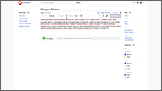

# Swiki for MediaWiki 1.39

**Swiki** is a [MediaWiki](https://www.mediawiki.org/wiki/MediaWiki) [extension](https://www.mediawiki.org/wiki/Extension:Swiki) that allows you to seamlessly embed [Swagger UI](https://github.com/swagger-api/swagger-ui) directly into your wiki pages using a simple `<swiki>` tag or through the [VisualEditor](https://www.mediawiki.org/wiki/VisualEditor). It includes a recent build of Swagger UI, providing full support for displaying your API documentation.

You can load OpenAPI or Swagger specifications in several ways: by embedding inline JSON, uploading a specification, referencing dedicated wiki pages that contain the specification, or linking to an external specification URL.

Swiki also includes [Swagger Dark Theme](https://github.com/Amoenus/SwaggerDark), which is nicely integrated with MediaWiki skins that support dark mode, such as Vector-2022 and Minerva. Additionally, it can parse tags from third-party extensions like [SwaggerDoc](https://github.com/Griboedow/SwaggerDoc).

## Screenshots

Swagger UI in light mode. Left: default preset. Right: standalone preset.

[](assets/swiki-swagger-ui-default-day.png) [](assets/swiki-swagger-ui-standalone-day.png)

Swagger UI in dark mode. Left: default preset. Right: standalone preset.

[](assets/swiki-swagger-ui-default-night.png) [](assets/swiki-swagger-ui-standalone-night.png)

VisualEditor integration in light mode. Left: Swiki in VisualEditor. Right: Swiki dialog/tool.

[](assets/swiki-visualeditor-edit-day.png) [](assets/swiki-visualeditor-dialog-day.png)

VisualEditor integration in dark mode. Left: Swiki in VisualEditor. Right: Swiki dialog/tool.

[](assets/swiki-visualeditor-edit-night.png) [](assets/swiki-visualeditor-dialog-night.png)

## Installation

Clone the extension into your MediaWiki `extensions` directory:

```bash
cd extensions/
git clone --branch REL1_39 https://github.com/vuhuy/Swiki
```

Then enable it by adding the following line to your `LocalSettings.php`:

```php
wfLoadExtension( 'Swiki' );
```

Optional configuration variables:

- `$wgSwikiForceColorScheme`: Forces a specific color scheme in Swagger UI. Accepted values are `auto`, `light`, or `dark`. Default: `auto`.

- `$wgSwikiValidatorUrl`: Specifies a Swagger validator for displaying a [validator badge](https://github.com/swagger-api/validator-badge), e.g., `https://validator.swagger.io/validator`. Default: `null`.

- `$wgSwikiEnableSwaggerDocHook`: Enables parsing of SwaggerDoc tags when set to `true`. Default: `false`.

To allow users to upload OpenAPI/Swagger specifications, ensure that file uploads are [properly configured](https://www.mediawiki.org/wiki/Manual:Configuring_file_uploads) and that `.json` is an allowed file extension:

```php
$wgFileExtensions[] = 'json';
```

## Usage

In order to use Swagger UI, provide your specification in JSON format or reference it via a link:

- A relative **direct link** to a JSON file upload, e.g. `/images/a/bc/swagger-petstore3.json`. File uploads must be enabled and configured. Uploads can be done via `Special:Upload`.
- A relative **raw link** to a wiki page that contains only the JSON specification, e.g., `/wiki/Swagger_Petstore_3.json?action=raw`. A raw link consists of the relative path to the page with the `?action=raw` query appended. Optionally, you can set the page’s content model to JSON via the `Special:ChangeContentModel` page (requires the `editcontentmodel` permission).
- An absolute **external link** to a specification, e.g. `https://petstore3.swagger.io/api/v3/openapi.json`. Must start with `https://` or `http://`.

### Visual editing

Insert a Swagger UI tag using the `Insert` menu in VisualEditor. Existing tags can be edited through their context menu. The Swagger UI dialog offers the following options:

- **OpenAPI/Swagger specification (JSON format):** Inline a JSON specification directly into the page. YAML is not supported. This will override the `Link` and `Links` fields when used.
- **Link:** Load a specification from a relative or absolute URL.
- **Links:** Load multiple specifications from URLs. Each entry must follow the format `url-to-spec|unique page name`, separated by yet another `|` character. If the URL contains a pipe, encode it as `%7C`. This option overrides the `Link` field and always uses the standalone preset.
- **Render with standalone preset:** Renders Swagger UI with a top bar (intended for standalone pages) that includes the URL or specification selector when multiple specifications are used.

### Source editing

Use the `<swiki>` tag to render Swagger UI. Specifications and options can be provided in several ways:

- **As content:** Inline the specification. Must be in JSON format, YAML is not supported. This will ignore the `url` and `urls` fields when used.

  ```html
  <swiki>
  {
    "openapi": "3.0.4",
    "info": {
      "title": "Swagger Petstore - OpenAPI 3.0",
      "description": "This is a sample Pet Store Server based on the OpenAPI 3.0 specification.",
      "termsOfService": "https://swagger.io/terms/",
      "contact": {
        "email": "apiteam@swagger.io"
      },
      "license": {
        "name": "Apache 2.0",
        "url": "https://www.apache.org/licenses/LICENSE-2.0.html"
      },
      "version": "1.0.12"
    },
    [...]
  }
  </swiki>
  ```

- **URL attribute:** Set the `url` attribute to render a single specification.

  ```html
  <swiki url="/images/a/bc/swagger-petstore3.json" />
  ```

- **URLs attribute:** Set the `urls` attribute to render multiple specifications. Entries must be formatted as `url-to-spec|unique page name`, separated by more pipes (`|`). Encode any pipe characters within URLs as `%7C`. This attribute overrides the `url` attribute and always uses the standalone preset.

  ```html
  <swiki urls="/wiki/Swagger_Petstore_2.json?action=raw|Swagger Petstore 2|/wiki/Swagger_Petstore_3.json?action=raw|Swagger Petstore 3" />
  ```

- **Standalone attribute:** When the `standalone` attribute is set, Swagger UI will render with a top bar.

  ```html
  <swiki url="/wiki/Swagger_Petstore_3.json?action=raw" standalone />
  ```

## Customization

The container in which Swagger UI is rendered can be styled using CSS via the `MediaWiki:Common.css` page. Only the outer container can be styled using this method. Swagger UI itself is rendered inside a shadow DOM, which isolates it from the rest of the wiki styles.

```css
.mw-ext-swiki-container
{
    /* Override container styles here. */
}
```

## Developer notes

### Override Swagger UI styles

If you have access to the extension’s source code, you can override the default Swagger UI styles. Add your custom CSS rules to `modules/swagger-ui/swagger-ui-custom.css`.

### Build Swagger UI bundle

The MediaWiki 1.43 ResourceLoader does not like the official Swagger UI ES6 build, but seems happy with an ES5 build. Clone the latest release from the [Swagger UI GitHub repository](https://github.com/swagger-api/swagger-ui) and create an ES5 build target in `webpack/es5-bundle.js`.

```js
const configBuilder = require("./_config-builder")
const { DuplicatesPlugin } = require("inspectpack/plugin")
const { WebpackBundleSizeAnalyzerPlugin } = require("webpack-bundle-size-analyzer")

const result = configBuilder(
  {
    minimize: true,
    mangle: true,
    sourcemaps: false,
    includeDependencies: true,
  },
  {
    target: ['web', 'es5'],
    entry: {
      "swagger-ui-es5-bundle": ["./src/index-es5.js"],
    },
    output: {
      globalObject: "this",
      filename: 'swagger-ui-es5-bundle.js',
      library: 'SwaggerUIBundle',
      libraryTarget: 'var' 
    },
    plugins: [
      new DuplicatesPlugin({
        emitErrors: false,
        verbose: false,
      }),
      new WebpackBundleSizeAnalyzerPlugin("log.es-bundle-sizes.swagger-ui.txt"),
    ],
  }
)

module.exports = result

```

Create the corresponding entry point at `src/index-es5.js`. This entry point spans both the Swagger UI ES bundle and standalone preset module.

```js
import SwaggerUI from "./core"
import StandaloneLayoutPlugin from "standalone/plugins/stadalone-layout"
import TopBarPlugin from "standalone/plugins/top-bar"
import ConfigsPlugin from "core/plugins/configs"
import SafeRenderPlugin from "core/plugins/safe-render"

const StandalonePreset = [
  TopBarPlugin,
  ConfigsPlugin,
  StandaloneLayoutPlugin,
  SafeRenderPlugin({
    fullOverride: true,
    componentList: ["Topbar", "StandaloneLayout", "onlineValidatorBadge"],
  }),
]

window.SwaggerUIStandalonePreset = StandalonePreset;
window.SwaggerUIBundle = SwaggerUI;

```

Update `package.json` to include the new ES5 build target.

```
"build:es5:bundle": "cross-env NODE_ENV=production BABEL_ENV=production BROWSERSLIST_ENV=isomorphic-production webpack --color --config webpack/es5-bundle.js",
```

Build the ES5 build target.

```bash
npm run build-stylesheets
npm run build:es5:bundle
```

Copy `dist/swagger-ui-es5-bundle.js` and `dist/swagger-ui.css` to the Swiki `modules/swagger-ui` folder. Rename `swagger-ui-es5-bundle.js` to `swagger-ui-bundle.js`. Then, add a new line containing `/*@nomin*/` at the top of both files.

### Integration tests

> ⚠️ Safari is not included. Please test on Apple devices separately.

This repository includes a GitHub Actions workflow that runs integration tests using Selenium on both Chrome and Firefox. If all tests pass, pray that Safari behaves — you're probably good to go. A simple Bash script for Linux systems (or Windows via WSL) is also provided to run the tests locally. You’ll need `docker`, `python3`, and `python3-venv` installed for that.

```bash
cd test/scripts
./run.sh
```

Optionally, you can specify a supported MediaWiki version, e.g.:

```bash
./run.sh 1.39
```

## Credits

- [Swagger UI](https://github.com/swagger-api/swagger-ui) (v5.21.0)
- [Swagger Dark Theme](https://github.com/Amoenus/SwaggerDark) (v1.0.4)